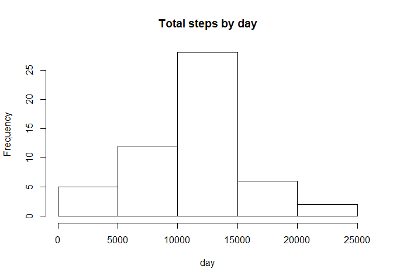

Load the data


```r
activity <- read.csv("activity.csv")
activity$date <- as.Date(activity$date, format = "%Y-%m-%d")
str(activity)
```

```
## 'data.frame':	17568 obs. of  3 variables:
##  $ steps   : int  NA NA NA NA NA NA NA NA NA NA ...
##  $ date    : Date, format: "2012-10-01" "2012-10-01" ...
##  $ interval: int  0 5 10 15 20 25 30 35 40 45 ...
```

#What is mean total number of steps taken per day?
-------------------------------------------------

1.Calculate the total number of steps taken per day.

```r
TotalSteps<-aggregate(steps~date,data=activity,sum,na.rm=TRUE)
TotalSteps
```

```
##          date steps
## 1  2012-10-02   126
## 2  2012-10-03 11352
## 3  2012-10-04 12116
## 4  2012-10-05 13294
## 5  2012-10-06 15420
## 6  2012-10-07 11015
## 7  2012-10-09 12811
## 8  2012-10-10  9900
## 9  2012-10-11 10304
## 10 2012-10-12 17382
## 11 2012-10-13 12426
## 12 2012-10-14 15098
## 13 2012-10-15 10139
## 14 2012-10-16 15084
## 15 2012-10-17 13452
## 16 2012-10-18 10056
## 17 2012-10-19 11829
## 18 2012-10-20 10395
## 19 2012-10-21  8821
## 20 2012-10-22 13460
## 21 2012-10-23  8918
## 22 2012-10-24  8355
## 23 2012-10-25  2492
## 24 2012-10-26  6778
## 25 2012-10-27 10119
## 26 2012-10-28 11458
## 27 2012-10-29  5018
## 28 2012-10-30  9819
## 29 2012-10-31 15414
## 30 2012-11-02 10600
## 31 2012-11-03 10571
## 32 2012-11-05 10439
## 33 2012-11-06  8334
## 34 2012-11-07 12883
## 35 2012-11-08  3219
## 36 2012-11-11 12608
## 37 2012-11-12 10765
## 38 2012-11-13  7336
## 39 2012-11-15    41
## 40 2012-11-16  5441
## 41 2012-11-17 14339
## 42 2012-11-18 15110
## 43 2012-11-19  8841
## 44 2012-11-20  4472
## 45 2012-11-21 12787
## 46 2012-11-22 20427
## 47 2012-11-23 21194
## 48 2012-11-24 14478
## 49 2012-11-25 11834
## 50 2012-11-26 11162
## 51 2012-11-27 13646
## 52 2012-11-28 10183
## 53 2012-11-29  7047
```

2. Make a histogram of the total number of steps taken each day


```r
hist(TotalSteps$steps, main = "Total steps by day", xlab = "day")
```

<!-- -->

```r
dev.copy(png, file="plot1.png", height=480, width=480)
```

```
## png 
##   3
```

```r
dev.off()
```

```
## png 
##   2
```

3.Calculate and report the mean and median total number of steps taken per day 


```r
meanSteps <- mean(TotalSteps$steps)
medianSteps <-median(TotalSteps$steps)
meanSteps
```

```
## [1] 10766.19
```

```r
medianSteps
```

```
## [1] 10765
```

The mean total number of steps taken per day is 1.0766189\times 10^{4} steps.
The median total number of steps taken per day is 10765 steps.


#What is the average daily activity pattern?
-------------------------------------------
1. Make a time series plot (i.e. type = "l") of the 5-minute interval (x-axis) and the average number of steps taken, averaged across all days (y-axis)


```r
StepsInterval<-aggregate(steps~interval,data=activity,mean,na.rm=TRUE)
plot(steps~interval,data=StepsInterval,type="l")
```

<!-- -->

```r
dev.copy(png, file="plot2.png", height=480, width=480)
```

```
## png 
##   3
```

```r
dev.off()
```

```
## png 
##   2
```

2. Which 5-minute interval, on average across all the days in the dataset, contains the maximum number of steps? 


```r
max <- StepsInterval[which.max(StepsInterval$steps),]$interval
max
```

```
## [1] 835
```

It is the 835th interval.

#Imputing missing values
-----------------------

1. Calculate and report the total number of missing values in the dataset (i.e. the total number of rows with NAs)

```r
missing <- sum(is.na(activity$steps))
missing
```

```
## [1] 2304
```

Total 2304 rows are missing.

2. Devise a strategy for filling in all of the missing values in the dataset. The strategy does not need to be sophisticated. For example, you could use the mean/median for that day, or the mean for that 5-minute interval, etc.


```r
IntervalFilling<-function(interval){
    StepsInterval[StepsInterval$interval==interval,]$steps
}
```

3. Create a new dataset that is equal to the original dataset but with the missing data filled in.


```r
ActivityFilled <- activity
count=0           
for(i in 1:nrow(ActivityFilled)){
    if(is.na(ActivityFilled[i,]$steps)){
        ActivityFilled[i,]$steps<-IntervalFilling(ActivityFilled[i,]$interval)
        count=count+1
    }
}
cat("Total ",count, "NA values were filled.\n\r")  
```

```
## Total  2304 NA values were filled.
## 

```

4. Make a histogram of the total number of steps taken each day and calculate and report the mean and median total number of steps taken per day. Do these values differ from the estimates from the first part of the assignment? What is the impact of imputing missing data on the estimates of the total daily number of steps?


```r
TotalSteps2<-aggregate(steps~date,data=ActivityFilled,sum)
hist(TotalSteps2$steps, main = "Total steps by day", xlab = "day")
```

<!-- -->

```r
meanSteps2 <- mean(TotalSteps2$steps)
medianSteps2 <- median(TotalSteps2$steps)
dev.copy(png, file="plot3.png", height=480, width=480)
```

```
## png 
##   3
```

```r
dev.off()
```

```
## png 
##   2
```

The mean total number of steps taken per day is 
1.0766189\times 10^{4} steps.
The median total number of steps taken per day is 
1.0766189\times 10^{4} steps.

The mean value is the same as the value before inserting missing data because we put the mean value for that particular 5-min interval. The median value shows a slight difference.

#Are there differences in activity patterns between weekdays and weekends?
---------------------------------------------------------------------------

1. Create a new factor variable in the dataset with two levels - "weekday" and "weekend" indicating whether a given date is a weekday or weekend day.


```r
ActivityFilled$day=ifelse(as.POSIXlt(as.Date(ActivityFilled$date))$wday%%6==0,
                          "weekend","weekday")
ActivityFilled$day=factor(ActivityFilled$day,levels=c("weekday","weekend"))
```

2. Make a panel plot containing a time series plot (i.e. type = "l") of the 5-minute interval (x-axis) and the average number of steps taken, averaged across all weekday days or weekend days (y-axis). 


```r
StepsInterval2=aggregate(steps~interval+day,ActivityFilled,mean)
library(lattice)
xyplot(steps~interval|factor(day),data=StepsInterval2,aspect=1/2,type="l", xlab = "Interval",ylab = "Number of steps")
```

<!-- -->

```r
dev.copy(png, file="plot4.png", height=480, width=480)
```

```
## png 
##   3
```

```r
dev.off()
```

```
## png 
##   2
```


